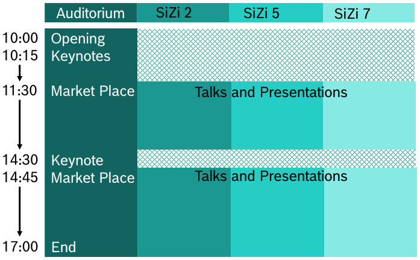

---
hide:
  - toc
---

# Agenda

## Preparation time

- Wednesday, July 12, 15:00  — 18:00
- Thursday, July 13, 8:00 — 10:00

## Conference agenda

The conference will take place on Thursday, July 13.

<!--
- 10:00 - 10:15 **Opening and welcome**
- 10:15 - 11:30 [**Keynotes**](../keynotes)
- 11:30 - 14:30 [**Market Place**](../market_place)
- 11:30 - 17:00 [**Talks, presentations**](../presentations)
- 14:30 - 14:45 [**VIP keynote: "Open Source Culture"**](../keynotes)
- 14:45 - 17:00 [**Market Place**](../market_place)
- 17:00 **Conference End**
-->
## Dismantling of the exhibition equipment

- Thursday, July 13, 17:00 - 19:00