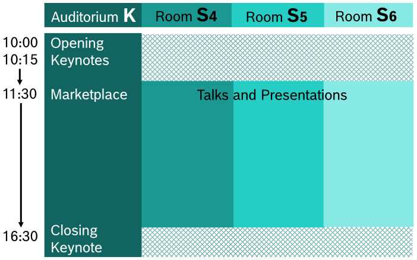

---
hide:
  - toc
---

# Agenda

## Preparation time

- Wednesday, July 12, 15:00  — 18:00
- Thursday, July 13, 8:00 — 10:00

## Conference agenda

The conference will take place on Thursday, July 13.

The full list of keynotes can be found [here](https://boschglobal.github.io/embedded-linux/keynotes/)).

The full list of talks can be found [here](https://boschglobal.github.io/embedded-linux/talks/)).

## Dismantling of the exhibition equipment

- Thursday, July 13, 17:00 - 19:00
