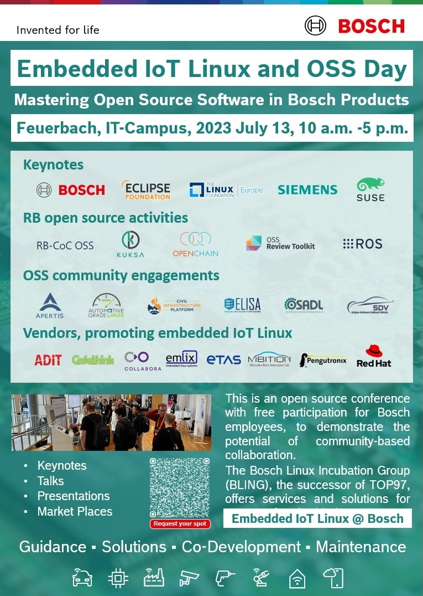



    {{ tile }}





    <a class="portal-tile" title="{{ description }}" href="{{ link }}">
        

            
             
            
{{ title }}

        

    </a>



# Embedded IoT Linux and OSS day

Welcome to the website of the 1st BOSCH internal conference on
Embedded IoT Linux and OSS!

The event will take place in Feuerbach, July 13th and is hosted by TOP97.

The conference shall attract all Bosch employees working on IoT products based
on embedded Linux.  
This includes Automotive, Industrial, Building Technologies, Power Tools, Smart
Home and Home Appliances.  
Our team interacts with those organizational entities in Bosch.  
It is planned to use the conference to demonstrate the potential of community
based collaboration.  
 Bosch participants will be invited to book services and solutions in the context
of the "Bosch Linux Incubation Group".  
Contributors will get in contact to developers, product owner, architects as
well as leaders and decision maker.  
We expect 200-500 guests in total. The conference cannot be opened for public.  
In case you want to meet specific peers or business contacts from BOSCH, let us
know.

