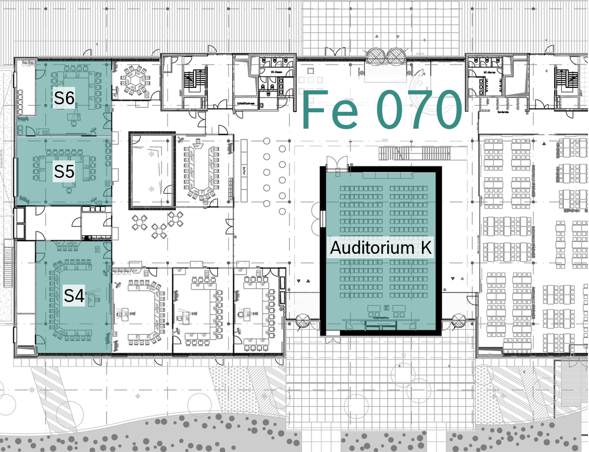

---
hide:
  - toc
---




# Venue

The Bosch Embedded Linux IOT and OSS Day will take place on the Bosch IT Campus
Feuerbach in building Fe 070. Detailed information on how to get to the
conference are given on this page.

## Address

The Bosch IT Campus Feuerbach is located at the following address.

{{ maps.map('48.81453', '9.16980', '<strong>Robert Bosch GmbH</strong> Borsigstr. 4 70469 Stuttgart Germany') }}

## Location

Enter the IT Campus through the main entrance. The conference takes place in
building Fe 070.

## Parking

Please park in P67 on floor 4. There, please use the parking spaces marked with
Bosch.

{{ shadows.img_shadow(src='../images/parking.png', alt='Parking Map', width='100%', max_width='650px') }}

## Floor Plan

The following plan shows the location of the Auditorium and the meeting rooms
that are used during the conference in building Fe 070.

**Room capacities**

- Room S4: 60 seats
- Room S5: 50 seats
- Room S6: 40 seats